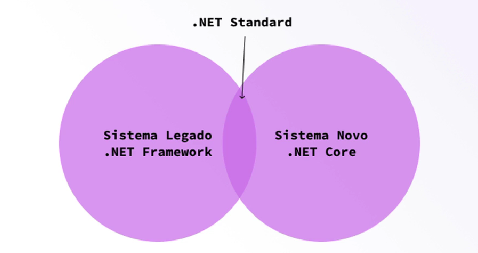
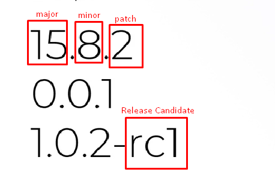

# Frameworks

Começar uma aplicação, ainda mais uma das grandes, é algo realmente desafiador e toda ajuda neste caso é bem-vinda.

Nos capítulos anteriores vimos que o C# é uma linguagem madura, e parte desta maturidade inclui trazer muita coisa pronta.

Em suma, temos uma base bem completa para iniciar nossas aplicações, podendo focar apenas no que precisamos para atender o negócio que estamos trabalhando.

## O que é um Framework?

Um framework é uma estrutura, um alicerce ou mesmo um conjunto de bibliotecas que usamos para construir nossas aplicações.

O conceito de framework existe em diversas tecnologias e linguagens e no caso das linguagens da Microsoft este framework se chama **.NET**.

A ideia por trás de um framework é trazer recursos que usamos com frequência no dia-a-dia já prontos, como por exemplo leitura e escrita de arquivos, acesso à dados, gerenciamento de memória e muitos outros.

É comum começarmos o desenvolvimento de aplicações sobre um framework. Na verdade não faz o menor sentido começar sem um e fazer tudo na mão.

Como você pode imaginar, um framework nos prove um reuso de códigos já escritos, validados e testados, que nos poupa muito tempo.

### Microsoft .NET (.NET Framework)

Junto ao C#, em meados de 2001, a primeira versão do framework para desenvolvimento de aplicações da Microsoft também foi lançado, chamado de **.NET Framework**.

O **.NET Framework** recebeu as versões 1.0, 1.1, 2.0, 3.0, 3.5, 4.0, 4.5, 4.6, 4.7 e até a escrita deste material se encontra na versão 4.8.

Suas versões podem ser instaladas lado-a-lado (Side by Side), o que significa que você pode ter várias versões do .NET Framework na mesma máquina.

Sendo somente compatível com sistema operacional Windows, este framework vem sendo descontinuado, dando lugar ao **.NET Core** (Também com instalação lado-a-lado).

Em meados de 2015, com o início do movimento para aplicações em nuvem (Cloud Computing), a Microsoft se viu forçada a suportar outros sistemas operacionais, em especial o Linux, que era base de boa parte dos servidores de aplicações Web do mundo.

Porém, mudar um framework não é uma tarefa fácil ainda mais em um com bilhões de usuários como era o caso do .NET Framework.

A Microsoft tomou então a iniciativa de construir um novo framework, com suporte a Windows, Mac e Linux, resolvendo o principal problema anterior.

O problema agora era o tempo de desenvolvimento, visto que o .NET Framework tinha anos de vida e centenas de milhares de linhas de código, desenvolver algo novo, do zero, com certeza não seria fácil.

Como resultado disso, veio o **Core** do nome do novo framework, que significa que ele inicialmente só continha o básico para as aplicações serem executadas.

### .NET Core

Embora em sua primeira versão o .NET Core tenha recebido apenas as bibliotecas básicas, em sua versão atual, a 3.1 ele está bem completo.

O .NET Core também passou a ser a recomendação da Microsoft para novas aplicações, ou seja, se estiver começando algo agora, não deve utilizar o .NET Framework mais.

Além de ser completamente reescrito, ele conta com inúmeras melhorias de segurança e performance, colocando-o no topo das listas.

Embora muito tenha mudado no .NET, o C# continua muito parecido, tendo sim incrementos, mas ainda sendo original em sua base.

### .NET Standard

Neste momento da história (Meados de 2015 até a escrita deste material) o **.NET Framework** e **.NET Core** coexistem e inclusive podem ser instalados na mesma máquina.

Além disso, podemos utilizar tanto .NET Core quanto .NET Framework no mesmo projeto, o que pode causar uma certa confusão.

Para garantir que tudo que criarmos seja compatível tanto com .NET Core quanto com o .NET Framework, existe uma padronização chamada de **.NET Standard**.



O .NET Standard é o que chamamos de **Surface API**, ou seja não é algo palpável ou visível, apenas um conjunto de definições.

Então não "programamos" em .NET Standard, e sim utilizamos ele como uma referência para saber o que podemos usar de cada framework a fim de ter uma compatibilidade entre ambos.

Podemos dizer que .NET Standard é a intersecção entre ambos frameworks, que nos garante que tudo que utilizarmos em um, estará presente em outro.


### .NET 5

Até a escrita deste material a versão atual do .NET Core é a 3.1, com lançamento da versão 5 programada para Novembro de 2020.

O .NET 5 será a junção de ambos frameworks, visto que o .NET Core já avançou tanto a ponto de conter quase tudo que o .NET Framework continha.

Isto também originou a versão deste novo framework, nomeada como **5**, pois o .NET Framework havia parado no 4.x.

O nome **Core** também será removido, visto que este será um framework completo, unindo os dois mundos que temos atualmente.

Embora muitas bibliotecas novas sejam adicionadas e recursos de performance sejam otimizados, todo código que escrevemos hoje, em C# utilizando .NET Core será reaproveitado.

A imagem abaixo ilustra tudo que será englobado nesta nova versão do .NET.


<small>[Fonte: https://devblogs.microsoft.com/dotnet/introducing-net-5/](https://devblogs.microsoft.com/dotnet/introducing-net-5/)</small>


## Releases

### Lançamentos

- .NET Framework
    - Não possui uma data de lançamento programada
- .NET Core
    - Lançamentos (releases) semestrais
- .NET 5 e futuros
    - Lançamentos anuais

### LTS

**LTS** é a sigla para **Long Term Support** ou em **Suporte de Longa Data** em português, o que significa que a Microsoft continuará a trabalhar nesta versão por um bom tempo.

- .NET Framework
    - Todos eram
- .NET Core
    - Versões com final `1`:
        - 1.1, 2.1, 3.1, ...
- .NET 5 e futuros
    - Versões maiores (Major Version)

É muito importante que opte sempre por escolher uma versão LTS para projetos longos, tanto pelo suporte quanto pela sua maturidade.

Começando agora por exemplo, não faria sentido escolher o .NET Core 3.0, sendo que temos o 3.1 que é LTS.

As versões LTS e recomendadas ficaram marcadas na lista de downloads do site oficial do .NET como mostrado abaixo.

```
.NET Core 3.1  (recommended) LTS
```

A palavra `recommended` em frente ao nome do framework significa que esta é a versão atual recomendada, enquanto a palavra `LTS` significa que esta versão terá uma longa vida de suporte.


## Versionamento

- Versão Semântica
- Dividida em fases:
    - Alpha, Beta, Release Candidate, Final
- Numeração dividida em 3 partes:
    - Major, Minor, Patch
- Exemplos:




- Podemos utilizar anotações com:
    - Alpha => `0.0.1-a1`
    - Beta => `0.0.2-b1`
    - Release Candidate => `1.0.0-rc1`
    - Final => `1.0.0`
- Normalmente alpha e beta têm versões menores que 1.0.0

## Runtime e SDK

### Runtime

- Como vimos anteriormente o Runtime é o responsável por executar e gerenciar nossas aplicações.
- As aplicações .NET são dividas em 3:
    - ASP.NET para aplicações Web
    - Desktop para aplicações Desktop
    - .NET Core para qualquer outra aplicação
        - Console, Batch, Serviço
        - Não possui uma interface por exemplo
- O Runtime também possui versões
    - A versão do Runtime tem que ser compatível com a versão da aplicação utilizada durante a codificação
- O Runtime só é utilizado para executar/rodar as nossas aplicações
    - Deixando estas em um tamanho menor, otimizado para execução

### SDK

- **SDK** é a sigla para Software Development Kit ou em português, kit para desenvolvimento de software.
- Possui tudo que precisamos para criar aplicações
- Já vem com o Runtime integrado
- Não devemos utilizar em produção
    - Para executar em produção precisamos apenas do Runtime
- É maior que o Runtime
    - Já que vem com tudo que precisamos

### Requisitos

Acesse sempre o site oficial para saber quais os requisitos de máquina necessários para executar cada versão tanto do Runtime quanto do SDK ([Link](https://dotnet.microsoft.com))


## Instalação

Sempre busque a instalação oficial do .NET que é [https://dotnet.microsoft.com](https://dotnet.microsoft.com/). Evite fazer o download do Runtime ou SDK de qualquer outra fonte.

Caso queira ir direto para o download da versão desejada basta adicionar os seguintes parâmetros na URL https://dotnet.microsoft.com/`download`/`dotnet-core`/`$VERSAO`.

> **\$VERSAO** é a versão do .NET que você deseja baixar, no caso utilizaremos a **3.1** (mas você pode baixar uma LTS mais atual).

No caso, nossa URL fica assim [https://dotnet.microsoft.com/download/dotnet-core/3.1](https://dotnet.microsoft.com/download/dotnet-core/3.1), e ao acessar este endereço nos será listado tanto o SDK quanto os Runtimes.

Note que a versão exibida é **3.1.201**, sendo que o **201** no final representa versões que foram enviadas com pequenas correções, que também chamamos de **minor changes**.

Estas atualizações não impactam no código que já produzimos, elas não causam nenhum impacto para nós. Toda vez que uma versão nova quebra algo que já está funcionando, chamamos isto de **breaking changes**.

Existem outras informações que trataremos mais adiante, mas por enquanto o que importa é fazer o download do pacote desejado, que fica na coluna **Installers** para o seu sistema operacional.

Tanto a instalação no Mac ou Windows são realizadas através de um wizard (Passo a passo). No Linux é necessário a execução de alguns comandos, mas de forma geral são bem simples.

Para prosseguir você precisa realizar a instalação da SDK desejada, de acordo com o sistema operacional que esteja utilizando.

Embora diversos sistemas e versões sejam suportadas, abaixo segue uma tabela de recomendações.

| SO             | Versão Mínima | Versão Recomendada |
| -------------- | :-----------: | :----------------: |
| Windows        |      10       |         10         |
| MacOs          |  High Sierra  |      Catalina      |
| Linux (Ubuntu) |     18.04     |       20.04        |
