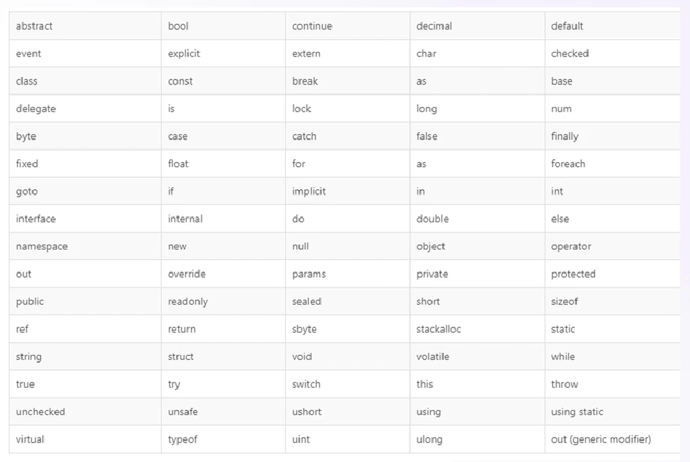
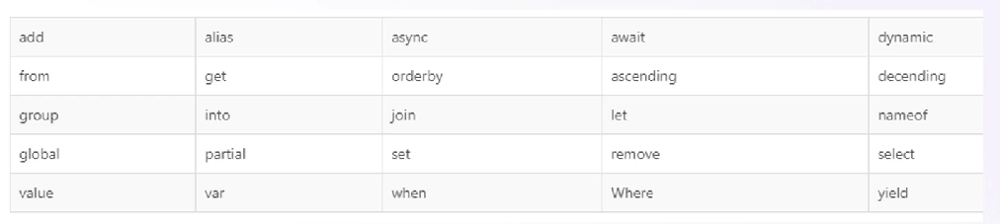

# Linguagem de Programação com C#

## Notas importantes

- Não utilize espaços nem caracteres especiais na criação do programa:
    - Bons: `MeuApp`, `Pedidos`, `MinhaApp`
    - Ruins: `Meu App`, `$APP`, `App #Test`
- Tentar utilizar caminhos curtos e sem caracteres especiais:
    - Bons: `C:\dev`, `C:\apps`
    - Ruins: `C:\Caminho com espaços e caracteres especiais\Meu App`
- Evite caminhos de rede:
    - Se possível utilize o `C:\`
- O C# é Code Sensitive:
    - Isto significa que ele diferencia maiúsculas de minúsculas
    - Ex: `Teste` é diferente de `test`

## Escopo de um programa

- O escopo de um programa refere-se ao contexto em que as variáveis e funções são definidas e podem ser acessadas.
- Ele determina onde no código uma variável ou função pode ser usada e se outras partes do código podem interagir com ela.
- O escopo pode ser global (acessível em todo o programa) ou local (restrito a partes específicas do código)
- Em C# o fluxo de um escopo possui basicamente a seguinte estrutura:
    - Importações
    - Namespaces
    - Classe
    - Método Principal

Aqui temos um exemplo da Sequência Fibonacci implementada em C#:

```cs
using System;
using System.Linq;

namespace FibonacciTest
{
    public class Program
    {
        public static void Main()
        {
            // CODE CHANGES
            foreach (var i in FibonacciGenerator.Fibonacci().Take(20))
            {
                Console.WriteLine(i);
            }
        }
    }
}
```

## Namespace

- Enquanto as pastas e arquivos são as divisões físicas
- Os namespaces são as divisões lógicas
- Assim como não podemos ter dois arquivos com mesmo nome nas pastas
- Não podemos ter duas classes com o mesmo nome em um namespace
- O ideal é ter apenas um namespace e uma classe por arquivo
- O escopo de um namespace é definido entre CHAVES
    - Classes e métodos também
- Um namespace pode ser reutilizado
    - Pode estar presente em diversos arquivos
- Podemos criar quantos namespaces quisermos
- Não devem conter espaços ou caracteres especiais
- Toda palavra no namespace começa com maiúsculo
- Podemos ter um namespace dentro de outro usando `.`
- A importação que vimos anteriormente é feita pelos namespaces
- Normalmente acompanham os nomes das pastas
- Durante a execução/compilação, todos os arquivos do C# serão unificados
- A divisão física se perderá
- Sobrará apenas a divisão lógica, que são os namespaces

## Using

- Importações definem as bibliotecas que nosso programa irá utilizar
- Por padrão só o básico vem incluso
- Precisamos importar o que desejamos para poder trabalhar
- Isto é feito no começo do programa
- Utilizamos a palavra-chave reservada `using` para isso
- Organizar nosso código em pastas e namespaces é fundamental
- Em aplicações grandes, o volume de código é alto
- A quantidade de arquivos é alta
- E o número de pessoas trabalhando no mesmo projeto também
- Entender bem esta organização é fundamental
- Use e abuse da criação de arquivos e namespaces

## Variáveis

- Uma variável é algo que utilizamos para armazenar uma informação
- Ser variável significa que seu valor pode ser alterado a qualquer momento
- Ou seja, ele pode variar
- Sempre que "criamos"/"instanciamos" uma variável, dizemos que estamos inicializando ela
- Podemos usar um TIPO ou palavra-chave reservada `var` para criar uma variável
- Vamos aprender ainda sobre tipos de dados
- No C# o tipo vem sempre antes do nome da variável
- Podemos informar um valor já na criação da variável
- Se não informado o valor padrão será aplicado

Exemplo:
```cs
int idade; // Correto, inicia com ZERO
int idade = 25; // Correto, inicia com 25
var idade = 25; // Correto, inicia com 25
var idade; // Errado
```

Padronização de Nomes:
- Utilize nomes coesos
- Não utilize caracteres especiais ou espaços
- Não comece com números
- A primeira letra de cada palavra é **SEMPRE** minúscula 

## Constantes

- Assim como as variáveis, também utilizamos uma constante para armazenar uma informação
- As constantes NÃO PODEM ser alteradas
- Uma vez criadas somos obrigados a atribuir um valor
- Feito isso elas não poderão ser modificadas novamente
- Não funcionam com a utilização de `var`
- São mais otimizadas que as variáveis
- Recomendadas para usos frequentes
- A definição de constante é dada pela palavra-chave reservada `const` antes do tipo
- Caso não seja informado um valor, o valor padrão será atribuído

Exemplo:
```cs
const int IDADE_MINIMA; // Correto inicia com ZERO
const int IDADE_MINIMA = 25; // Correto inicia com 25
const var IDADE_MINIMA = 25; // Errado
const var IDADE_MINIMA; // Errado
```

Padronização de Nomes:
- Utilize nomes coesos
- Não utilize caracteres especiais ou espaços
- Não comece com números
- É comum vermos constantes todas em maiúsculas, separadas por `_`
- A ideia é bater o olho no código e saber que aquilo é uma constante

## Palavras reservadas

- Também chamados de **keywords** (palavras-chave)
- São palavras de uso exclusivo do C#
- Não podemos utilizar como nomes de variáveis ou constantes
- O Visual Studio Code vai te avisar sobre elas

Tabela de keywords:



## Comentários

- Em diversos cenários você precisará deixar uma mensagem
- Essa mensagem não deve ser executada pelo programa
- É comum utilizarmos comentários em linhas que não desejamos executar também
- Podemos ter comentários de:
    - Uma linha
    - Múltiplas linhas
    - XML (Metadata)

Exemplo:
```cs
// Comentário em uma linha

/*
    Comentário em várias
    linhas
*/

/// Notação XML (Metadata)
```

## Tipos primitivos

- Também conhecidos como `build-in-types`
- São tipos de dados base cujo os outros tipos (`complexos`) irão derivar
- Definir o tipo correto otimiza a execução do programa
- Também são chamados de **Tipos de Valor**
- Armazenam um valor e não a referência para um item na memória
- São classificados em:
    - Tipos Simples (`Simple Types`)
    - Enumeradores (`Enums`)
    - Estruturas (`Structs`)
    - Tipos Nulos (`Nullable Types`) 
- Cada tipo possui uma capacidade (de quando de dado ele consegue conter/guardar)
- Caso esta capacidade exceda, o programa gera um erro
- Esta capacidade pré-definida ajuda na otimização do seu programa
- Por exemplo, o `int` que usamos previamente:
    - `-2,147,483,648` até `2,147,483,647`

## System

- No .NET tudo começa de um tipo base chamado `system`
- Todo e qualquer tipo, seja `build-in` ou `complexo` deriva dele
- Ele é a base de todos os objetos no .NET
- Não precisamos nos preocupar em usá-lo ou qualquer coisa similar
- Seu uso já é implícito

## Byte

- É um tipo primitivo (`build-in`)
- O tipo `byte` é utilizado para representar um byte de fato (ou seja, qualquer combinação de 8 bits)
- Em diversos casos precisamos da cadeia de bytes de um arquivo, por exemplo
    - Também chamado de `byte array`
- Temos também o `sbyte`, que permite valores negativos

> **Signed** e **Unsigned**
>
> Valores com sinal como `-` por exemplo, são chamados de signed. 

- 1 byte (8-bit)
    - 0 até 255
- 1 sbyte (8-bit)
    - -128 até 127

> Note que o `sbyte` permite valores negativos, por isso no nome `sbyte`, que significa **Signed Byte**

## Números Inteiros

- Números inteiros, ou seja, sem pontuação, podem ser definidos pelos tipos:
    - `short/ushort`
    - `int/uint`
    - `long/ulong`
- Assim como temos o `signed` nos `bytes`, nos números por padrão são permitidos valores negativos
- Então usamos o `unsigned` para definir que o mesmo não pode receber valores negativos
- O tipo `int` é o mais comum a ser encontrado
- short (16-bit)
    - `-32,768` até `32,767`
- ushort (16-bit)
    - `0` até `65,535`
- int (32-bit)
    - `-2,147,483,648` até `2,147,483,647`
- uint (32-bit)
    - `0` até `4,294,967,295`
- long (64-bit)
    - `-9,223,372,036,854,775,808` até `9,223,372,036,854,775,807`
- long (64-bit)
    - `0` até `18,446,744,073,709,551,615`

## Números Reais

- São números que exigem uma maior precisão, ou seja, com pontuação:
    - `float` (Notação F)
    - `double`
    - `decimal` (Notação M)
- Possuem assimilação negativa e positiva por padrão, dispensando o uso do signed/unsigned em seus tipos
- Ocupação:
    - float (32-bit)
        - `-3.402823e38` até `3.402823e38`
    - double (64-bit)
        - `-1.79769313486232e308` até `1.79769313486232e308`
    - decimal (128-bit)
        - (+ ou -) `1.0 x 10e-28` até `7.9 x 10e28`

## Boolean

- Tipo booliano, armazena apenas `true` ou `false` (verdadeiro ou falso)
- Definido pela palavra reservada `bool`
- bool (8-bit)
    - `true` ou `false`
